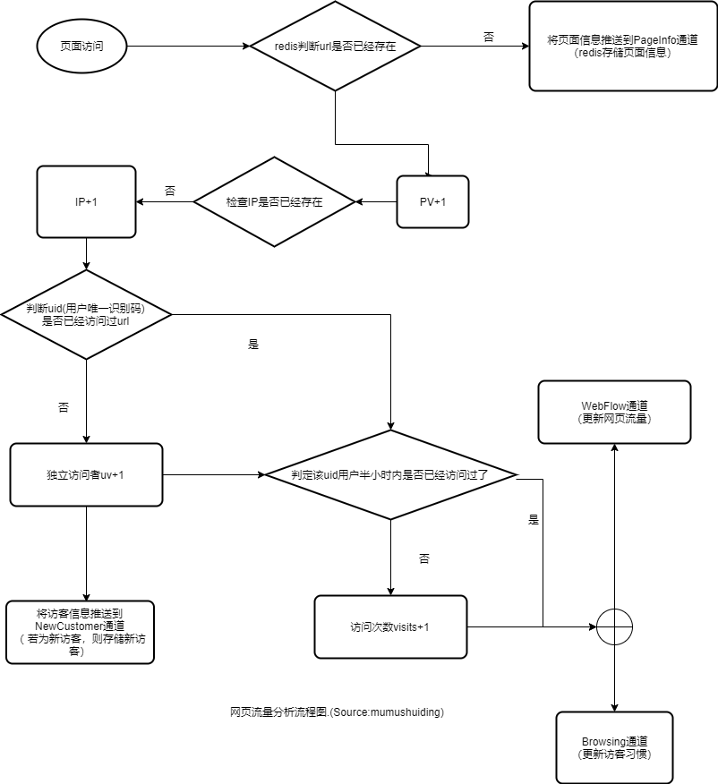

// WebData 页面信息
type WebData struct {
	Pageinfo model.Pageinfo `json:"p"`
	WebFlow  model.WebFlow  `json:"w"`
	Browsing model.Browsing `json:"b"`
	Type     string         `json:"t"`
}

## 页面信息

```
// Pageinfo 页面信息
type Pageinfo struct {
  Dm  string `json:"dm"`  // 域名
	URL string `json:"url"` // 网址
	// Keywords 关键词
	Keywords      string `json:"keywords"`
	Description   string `json:"description"`
	Filetype      int8   `json:"filetype"`
	Publishedtype int8   `json:"publishedtype"`
	Pagetype      int8   `json:"pagetype"`
	Catalogs      string `json:"catalogs"`
	Contentid     string `json:"contentid"`
	Publishdate   string `json:"publishdate"`
	Author        string `json:"author"`
	Source        string `json:"source"`
}
```


## 流量统计

```
// WebFlow 网页流量
type WebFlow struct {
	Model
	URL    string `json:"url"`    // 网址
	PV     int    `json:"pv"`     // 页面浏览量
	IP     int    `json:"ip"`     // 访问ip数
	UV     int    `json:"uv"`     // 独立访问者数
	Visits int    `json:"visits"` // 访问次数(半个小时内多次算一次)
	BR     int    `json:"br"`     // Bounce Rate 跳出率,只访问一次就跳出
}
```

## 访客习惯

```
// Browsing 用户访问习惯
type Browsing struct {
	UID        string    `json:"uid"`        // 用户id
	Depth      int       `json:"depth"`      // 访问页面数
	PV         int       `json:"pv"`         // 页面浏览量
	Visits     int       `json:"visits"`     // 访问次数(半个小时内多次算一次)
	Duration   uint64    `json:"duration"`   // 浏览时长
	Pageopend  int       `json:"pageopend"`  // 同时打开页面数
	Region     string    `json:"region"`     // 区域
	OS         string    `json:"os"`         // 操作系统
	Browser    string    `json:"browser"`    // 浏览器
	DeviceType int       `json:"deviceType"` // 终端类型 0为电脑、1为手机
	SR         string    `json:"sr"`         // 屏幕分辨率
	Start      time.Time `json:"start"`      // 开始时间
	NV         int       `json:"nv"`         // new visitor 0为用户回访,1为今天新访客
}
```

## 网页流量统计流程图




## redis 缓存


#### 网页页面信息
https://www.cnblogs.com/xujishou/p/6423453.html
<!-- hashmap -->
tongji_pageinfo_<yyyy-mm-dd>_<url>:Pageinfo // 用于纪录页面信息


#### 网页流量统计
<!-- set -->
tongji_url_<yyyy-mm-dd>：url // 通过 sort tongj
-url-<yyyy-mm-dd> by tongji-domain-webflow-<yyyy-mm-dd>-*->pv desc根据流量降序排序
<!-- hashmap -->
tongji_webflow_<yyyy-mm-dd>-<url>: WebFlow
<!-- set -->
tongji_ip_<yyyy-mm-dd>_<ip>: url // 统计指定ip访问过的页面

<!-- set 半小时内独立用户是否已经访问过了,只保存半小时 -->
tongji_visits_url_<yyyy-mm-dd>_<visitor>:url

#### 访客习惯

<!-- set-->
tongji-visitor-url-<yyyy-mm-dd>-<visitor>: url   // 统计独立用户查看过的页面，用于统计浏览深度
<!-- hashmap -->
tongji_browsing_<yyyy-mm-dd>_<visitor>: Browsing //用于统计独立用户的访问习惯

#### 时段分析:pv、uv、ip


// 统计独立用户数
<!-- set -->
tongji-domain-visitor-pageopend-<yyyy-mm-dd>-<visitor>: number// 统计独立用户当前同时打开页面数，为0时删除
<!-- hashmap -->
tongji-domain-ip-pageopend-<yyyy-mm-dd>-<ip>:number// 统计ip同时打开页面数，为0时删除


